<div align="center">

# 🐡 Baiacu

### Abra a mão. Infle o peixe. Desvie dos corais.

Um jogo de navegador em que você controla um baiacu **com a sua mão, pela webcam**.<br>
Junte pérolas, ganhe moedas e vista seu baiacu de cartola, coroa ou cachecol.

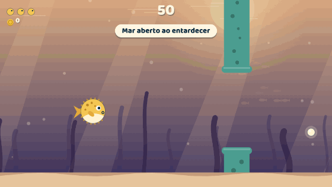

<br>


</div>

---

## 📚 Sumário

| | | |
|---|---|---|
| 🚀 [Como rodar](#-como-rodar) | 🪸 [Corais, pérolas e pontos](#-corais-pérolas-e-pontos) | 🛍️ [Loja](#️-loja) |
| 🎮 [Como jogar](#-como-jogar) | ❤️ [Vidas](#️-vidas) | 🔊 [Som](#-som) |
| 🕹️ [Controles](#️-controles) | 📈 [Dificuldade](#-dificuldade) | 💾 [Progresso salvo](#-progresso-salvo) |
| 🗺️ [Telas do jogo](#️-telas-do-jogo) | 🌊 [Zonas](#-zonas) | 🎓 [Tutorial e calibração](#-tutorial-e-calibração) |
| 🐡 [O baiacu](#-o-baiacu-tamanho-é-movimento) | 🪙 [Moedas](#-moedas) | ⏸️ [Pausa](#️-pausa) |
| 🤖 [Detecção da mão](#-como-a-mão-é-detectada) | 🆘 [Deu ruim?](#-deu-ruim) | 🧩 [Código](#-estrutura-do-código) · 🔧 [Ajustes](#-ajustando-o-jogo) |

---

## 🚀 Como rodar

Não tem instalação nem build. São só arquivos estáticos: `index.html`, `style.css` e três scripts comuns (`audio.js`, `loja.js`, `game.js`).

1. Abra a pasta no **VS Code**.
2. Instale a extensão **Live Server** e clique em **Go Live** (ou rode `npx serve` dentro da pasta).
3. Abra o `http://localhost:...` no **Chrome** ou no **Edge** e libere a câmera. 📸

> 💡 Abrir o `index.html` direto do disco também funciona (os scripts não são módulos ES justamente para isso), mas o navegador vai pedir a permissão da câmera toda vez.

### ✅ O que você precisa

- 🌐 **Navegador moderno** (Chrome, Edge ou Firefox recentes).
- 🔐 **Contexto seguro** para a câmera: `localhost`, `https://` ou arquivo local. Um `http://` de outra máquina é bloqueado.
- 📶 **Internet na primeira vez**, para baixar o detector de mão ([MediaPipe Hand Landmarker](https://ai.google.dev/edge/mediapipe/solutions/vision/hand_landmarker) `0.10.14`, alguns MB) e as fontes.
- ⌨️ Sem câmera? Sem problema: o modo teclado não precisa de nada disso.

---

## 🎮 Como jogar

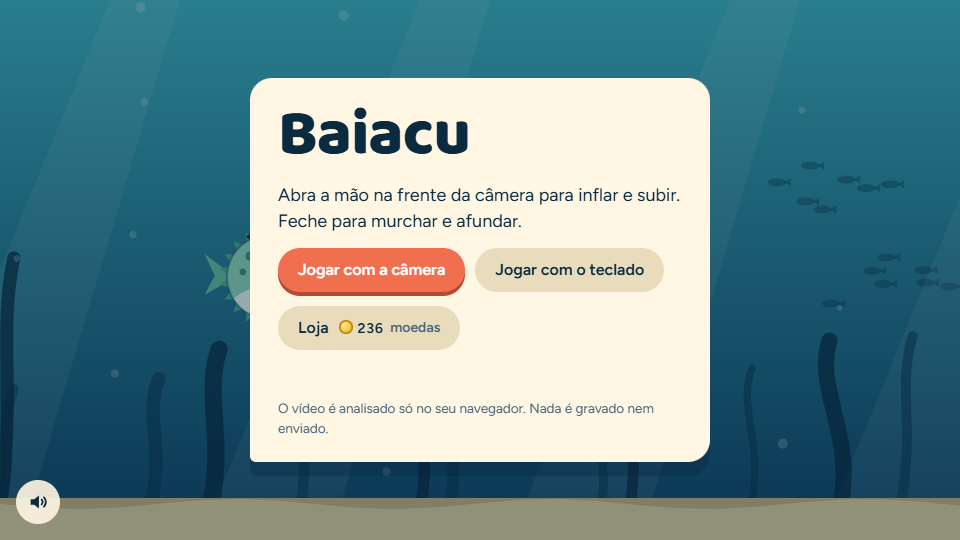

O fundo do mar rola sozinho da direita para a esquerda. O baiacu fica sempre na mesma posição horizontal: você controla **só a altura e o tamanho** dele.

- 🪸 Passe pelas aberturas entre os corais sem encostar.
- 🫧 Pegue as **pérolas**: valem pontos **e** moedas.
- 🩷 Nas **fendas estreitas** (corais rosa listrados), só passa baiacu magrinho.
- 🌊 A cada 20 pontos o cenário muda de **zona**.
- 🪙 No fim da partida, a pontuação vira **moedas** para gastar na **loja**.
- ❤️ Você tem **3 vidas**. Acabou, acabou.

> 🧠 **O pulo do gato (ou do peixe):** tamanho e movimento são a mesma coisa. Para **subir**, o baiacu precisa **inflar** e fica enorme. Para ficar **pequeno**, ele **murcha** e afunda. Atravessar uma fenda estreita pede a mão **meio aberta**: peixe médio, parado na altura certa.

---

## 🕹️ Controles

### ✋ Com a câmera

| Gesto | | O que acontece |
|:---:|:---:|---|
| 🖐️ Mão bem aberta | 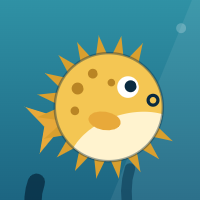 | Infla e **sobe** ⬆️ |
| 🤏 Mão meio aberta | 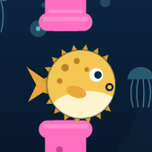 | Tamanho médio, **mantém a altura** ↔️ |
| ✊ Mão fechada | 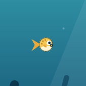 | Murcha e **afunda** ⬇️ |
| 🙈 Mão fora da câmera | | O jogo **pausa sozinho** |

No canto da tela aparece a prévia da câmera, com o **esqueleto da sua mão** desenhado por cima e uma barra de **Abertura** de 0% a 100%.

> 💡 Deixe a mão inteira visível, a uns **dois palmos** da tela, com a palma virada para a câmera e boa iluminação.

### ⌨️ Com teclado, mouse ou toque

| Tecla / ação | O que faz |
|---|---|
| Segurar **`Espaço`**, **`↑`** ou **`W`** | 🎈 Infla e sobe |
| Soltar | 💨 Murcha e afunda |
| Toques curtos | ↔️ Mantém a altura |
| Segurar o clique / o dedo na tela | 👆 Igual a segurar o espaço |
| **`P`** ou **`Esc`** | ⏸️ Pausa / retoma |
| **`M`** | 🔇 Liga / desliga o som |
| **`Enter`** | ✅ Aperta o botão principal da tela (Começar, Jogar de novo, Continuar) |

No teclado, o baiacu não infla de uma vez: leva uns **0,4 s** para ir de murcho a totalmente inflado, e o mesmo para murchar.

> 🔄 **Trocou de ideia?** Dá para mudar de modo a qualquer hora, nos dois sentidos:
> - ⏸️ **Na pausa:** *Trocar para o teclado* ou *Trocar para a câmera*. A partida continua de onde parou.
> - 💀 **No fim de jogo:** *Jogar com a câmera* ou *Jogar com o teclado* começa uma partida nova no outro modo. Na primeira vez que a câmera liga, o jogo passa pelo tutorial para calibrar a sua mão.

> 🛍️ A **loja** é operada por mouse, toque ou teclado (`Tab`, `Enter`, setas entre as abas, `Esc` para voltar). Ela não usa a mão.

---

## 🗺️ Telas do jogo

```
 🏠 Início ──► 🎓 Tutorial ──► 3️⃣2️⃣1️⃣ Contagem ──► 🎮 Jogando ──► 💀 Fim de jogo
    │               │                               │   ▲                 │
    │               └──── Pular tutorial ───────────┘   │                 ├── Jogar de novo ──► Contagem
    │                                               ⏸️ Pausa              ├── Rever tutorial ──► Tutorial
    └──────────────────────► 🛍️ Loja ◄────────────────────────────────────┘
```

| | |
|:---:|:---:|
| 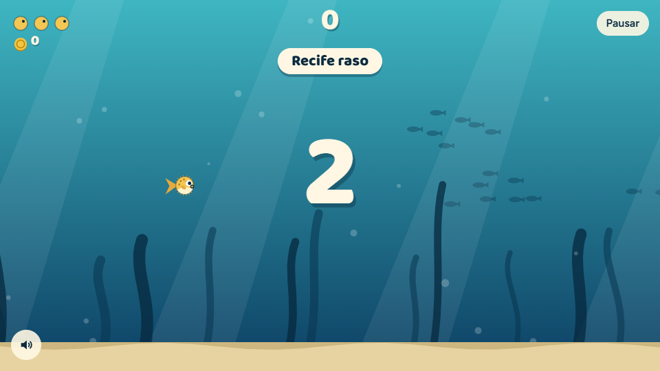 | 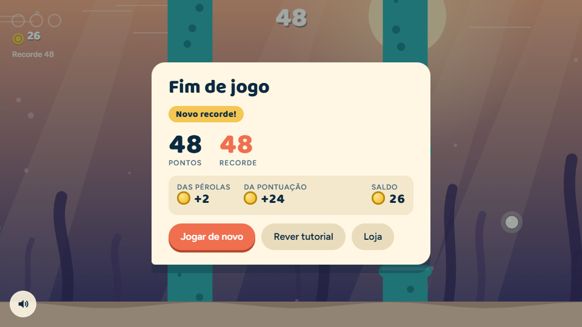 |
| **3, 2, 1…** com um bipe por número. O baiacu já responde à mão. | **Fim de jogo**: pontos, recorde e as moedas ganhas. |

1. 🏠 **Início:** *Jogar com a câmera*, *Jogar com o teclado* ou abrir a **Loja** (o saldo de moedas aparece no botão).
2. 🎓 **Tutorial:** ensina os gestos passo a passo. Dá para pular.
3. 3️⃣ **Contagem:** 3 segundos antes de o cenário andar. O nome da primeira zona aparece no alto.
4. 🎮 **Jogando:** placar no centro; vidas, moedas e recorde à esquerda; *Pausar* à direita.
5. 💀 **Fim de jogo:** pontos, recorde (com destaque quando é batido) e o resumo das moedas. Daqui você joga de novo, revê o tutorial, vai à loja ou troca entre câmera e teclado.

🔊 O botão de som fica **sempre** no canto inferior esquerdo, em qualquer tela.

📐 A tela se adapta à janela: a altura lógica é sempre 540 px e a largura acompanha a proporção da tela (mínimo de 520 px). **Tela mais larga = você enxerga mais corais à frente.**

---

## 🐡 O baiacu: tamanho é movimento

Tudo o que você faz, com a mão ou com o teclado, vira um único número: a **abertura**, de **0** (murcho) a **1** (inflado).

<div align="center">

|  |  |  |
|:---:|:---:|:---:|
| **Abertura 0** | **Abertura 0,5** | **Abertura 1** |
| raio 13 px · afunda rápido | raio ~33 px · parado | raio 54 px · sobe rápido |

</div>

- 📏 **Tamanho:** o raio vai de 13 px a 54 px. Os espinhos e as roupas são **só enfeite**: para bater, conta só o corpo (88% do raio).
- ⚖️ **Ponto neutro:** abertura **0,5** = baiacu parado.
- 😌 **Zona morta:** entre **0,43 e 0,57** ele também fica parado, para sua mão não precisar ser de estátua.
- 🚀 **Velocidade:** quanto mais longe do neutro, mais rápido ele sobe ou desce, até **250 px/s**.
- 🌊 **Inércia:** a velocidade muda suavemente, e o peixe inclina para o lado em que está indo (as roupas inclinam junto).
- 🏖️ **Teto e areia não machucam:** o baiacu só para ao encostar neles.

---

## 🪸 Corais, pérolas e pontos

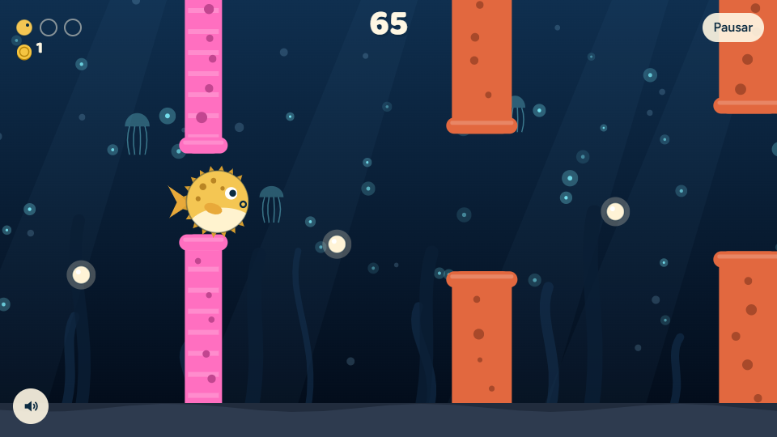

### Corais

Cada obstáculo é um par de rochas (uma descendo do teto, outra subindo da areia) com uma passagem no meio.

| Tipo | Aparência | Altura da passagem | Largura | Pontos |
|---|---|---|---|:---:|
| 🧡 Coral normal | Cor da zona (laranja, âmbar ou verde-água) | 215 px → 170 px | 74 px | **+1** |
| 🩷 Fenda estreita | **Magenta com listras claras**, em todas as zonas | 100 px | 46 px | **+3** |

- 🧭 A altura da passagem muda de um coral para o outro, mas **no máximo 170 px**, então sempre dá para chegar.
- 🩷 Fendas estreitas só aparecem **depois dos 4 primeiros corais**.
- 🎈 Inflado ao máximo, o corpo do baiacu tem uns **95 px** de diâmetro para colisão, quase toda a fenda estreita. Na prática: **atravesse meio aberto ou menor**.
- 💥 **Bateu, não pontuou:** o coral em que você encostou não dá ponto, mesmo que você termine de atravessar.

### Pérolas 🫧

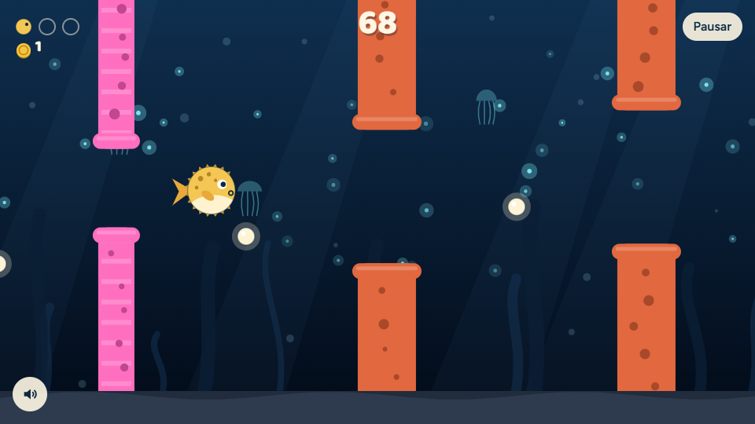

- Cerca de **65%** dos corais trazem uma pérola, no meio do caminho até o próximo, numa altura sorteada.
- Cada pérola vale **+2 pontos** e **+1 moeda na hora**. Ela é pega ao encostar no baiacu, então **inflado é mais fácil de pegar**. 😉

### 🏆 Placar

| Evento | Pontos | Moedas |
|---|:---:|:---:|
| 🧡 Passar por coral normal sem bater | **+1** | |
| 🩷 Passar por fenda estreita sem bater | **+3** | |
| 🫧 Pegar uma pérola | **+2** | **+1** na hora |
| 💀 Fim da partida | | **metade dos pontos** (arredondada para baixo) |

O **recorde** fica salvo no navegador e sobrevive a recarregar a página.

---

## ❤️ Vidas

- 🐡🐡🐡 Você começa com **3 vidas**, mostradas como baiacuzinhos (na cor que você estiver usando) no canto superior esquerdo.
- 💥 Encostou num coral: **perde uma vida**, ouve uma batida grave, a tela treme e o baiacu **pisca invencível por 1,6 s**.
- 🛡️ Cada coral tira **no máximo uma vida**, mesmo que você continue encostado nele.
- 💀 Zerou as vidas: **Fim de jogo**.

---

## 📈 Dificuldade

A dificuldade sobe com a **pontuação**, não com o tempo. Ela cresce aos poucos de **0 a 60 pontos** e depois fica no máximo.

| | 🐣 0 pontos | 🔥 60+ pontos |
|---|:---:|:---:|
| 🏃 Velocidade do cenário | 165 px/s | 270 px/s |
| 📏 Distância entre corais | 430 px | 330 px |
| 🚪 Passagem normal | 215 px | 170 px |
| 🩷 Chance de fenda estreita | 14% | 38% |

> ⚠️ Fendas e pérolas dão mais pontos, então **arriscar deixa o jogo mais difícil mais rápido**. As zonas não mexem na dificuldade: são só visuais.

---

## 🌊 Zonas

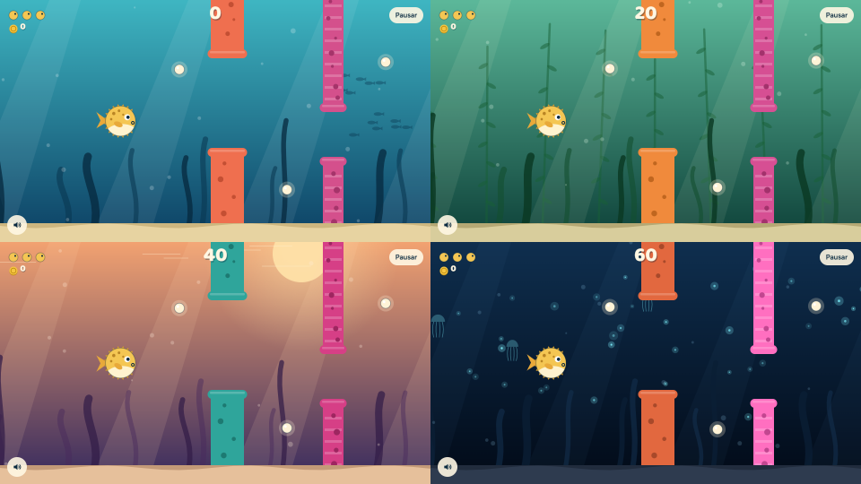

A cada **20 pontos** o cenário muda de zona, em ciclo (depois do fundo escuro, volta ao recife):

| Pontos | Zona | Enfeite |
|:---:|---|---|
| 0–19 | 🐠 **Recife raso** | Cardumes de peixinhos ao longe |
| 20–39 | 🌿 **Floresta de algas** | Algas gigantes com folhas balançando |
| 40–59 | 🌅 **Mar aberto ao entardecer** | Sol baixo e reflexos na superfície |
| 60–79 | 🌌 **Fundo escuro** | Plâncton e águas-vivas luminosos |

- 🎨 Cada zona tem sua paleta: gradiente da água, algas, areia e corais.
- 🌈 A troca é uma **transição de cores de 2 segundos**, nunca um corte seco, e o nome da zona aparece no alto por 2 segundos.
- 👀 A fenda estreita é sempre **magenta e listrada**. O peixe e as pérolas têm um contorno fino que mantém o contraste em qualquer zona, inclusive no escuro.

---

## 🪙 Moedas

- 🫧 **Cada pérola:** +1 moeda **na hora** (o saldo no canto da tela sobe na mesma hora).
- 🏁 **No fim da partida:** a pontuação vira moedas na proporção de **10 pontos para 5 moedas** (`floor(pontos × 0,5)`).
- 🧾 A tela de fim de jogo mostra **quanto veio das pérolas**, **quanto veio da pontuação** e o **saldo total**.
- 💾 As moedas ficam salvas no navegador.

Exemplo: uma partida com 37 pontos e 3 pérolas rende 3 + 18 = **21 moedas**.

---

## 🛍️ Loja

| | |
|:---:|:---:|
| 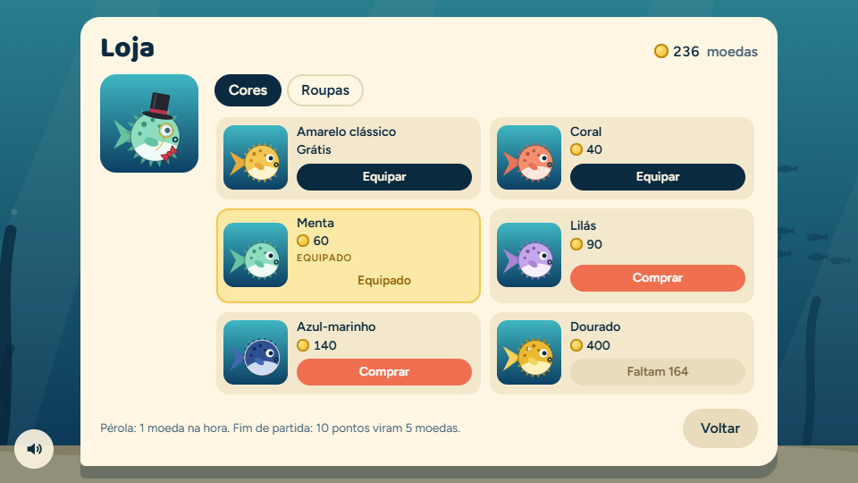 | 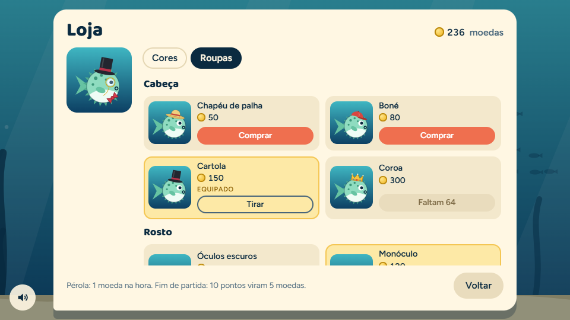 |
| **Cores:** o peixe inteiro muda de cor. | **Roupas:** uma por posição, combináveis. |

A loja abre pela **tela inicial** e pela **tela de fim de jogo**. Cada item mostra uma miniatura desenhada com a mesma função que desenha o peixe no jogo, o preço e um destes estados:

| Botão | Quando |
|---|---|
| **Comprar** | Você tem moedas suficientes. Comprar desconta o saldo, salva e já equipa. |
| **Faltam N** (desabilitado) | Não dá ainda: mostra quanto falta. |
| **Equipar** | Você já comprou, mas não está usando. |
| **Equipado** | É o que você está usando agora. Nas roupas, o botão vira **Tirar**. |

À esquerda fica uma prévia animada do seu baiacu com tudo o que está equipado.

### 🎨 Cores

Corpo, barriga, pintas, espinhos e nadadeiras mudam juntos.

| Cor | Preço |
|---|:---:|
| 💛 Amarelo clássico | grátis (já vem equipado) |
| 🧡 Coral | 🪙 40 |
| 💚 Menta | 🪙 60 |
| 💜 Lilás | 🪙 90 |
| 💙 Azul-marinho (com contorno claro, para aparecer no fundo escuro) | 🪙 140 |
| ✨ Dourado (com uma estrelinha que brilha) | 🪙 400 |

### 🎩 Roupas

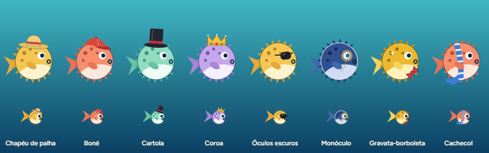

Três posições, **uma roupa por posição**, e dá para combinar as três:

| Posição | Roupa | Preço |
|---|---|:---:|
| 🎩 Cabeça | Chapéu de palha | 🪙 50 |
| | Boné | 🪙 80 |
| | Cartola | 🪙 150 |
| | Coroa | 🪙 300 |
| 🕶️ Rosto | Óculos escuros | 🪙 70 |
| | Monóculo | 🪙 120 |
| 🎀 Pescoço | Gravata-borboleta | 🪙 60 |
| | Cachecol | 🪙 100 |

As roupas acompanham o tamanho e a inclinação do baiacu (de 13 a 54 px de raio) e **não mudam a colisão**.

---

## 🔊 Som

Todo o som é **sintetizado na hora** com a Web Audio API. Não há nenhum arquivo de áudio.

| Quando | Som |
|---|---|
| 🎮 Durante a partida | Um tom suave e baixinho cuja altura acompanha a abertura: **grave murcho, agudo inflado** |
| 🫧 Pegou pérola | "Ploc" curto |
| 💥 Bateu | Batida grave |
| 🩷 Passou por fenda estreita | Efeito subindo |
| 3️⃣ Contagem | Um bipe por número (o último é mais agudo) |
| 💀 Fim de jogo | Quatro notas descendo |
| 🏆 Novo recorde | Arpejo subindo com acorde final |

- 🔇 **Botão de som sempre visível** no canto inferior esquerdo (ou tecla **`M`**). A preferência fica salva.
- ⏸️ Tudo **silencia na pausa** e quando a **aba perde o foco**.
- 🖱️ O áudio só começa depois do seu **primeiro clique ou tecla**, porque os navegadores bloqueiam som antes disso.

---

## 💾 Progresso salvo

O jogo guarda no `localStorage` do navegador, numa única chave (`baiacu:v1`):

- 🏆 recorde
- 🪙 saldo de moedas
- 🛍️ itens comprados e equipados
- 🔊 preferência de som

Se os dados estiverem ausentes, corrompidos, ou se o navegador bloquear o armazenamento (por exemplo, numa janela anônima restrita), o jogo **funciona normalmente** com os valores padrão, só não lembra de nada depois.

> 🧹 Para zerar tudo: no console, `localStorage.removeItem('baiacu:v1')` e recarregue.

---

## 🎓 Tutorial e calibração

| | |
|:---:|:---:|
| 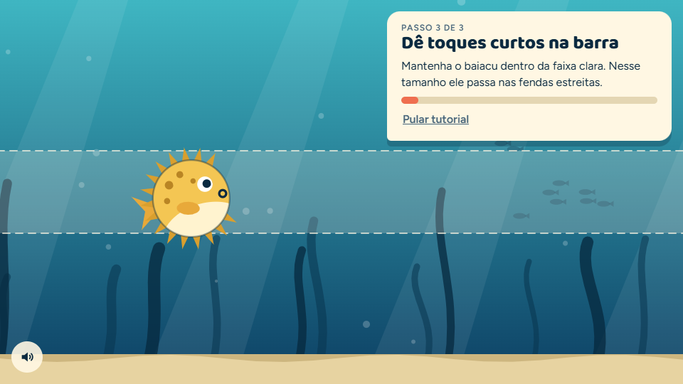 | 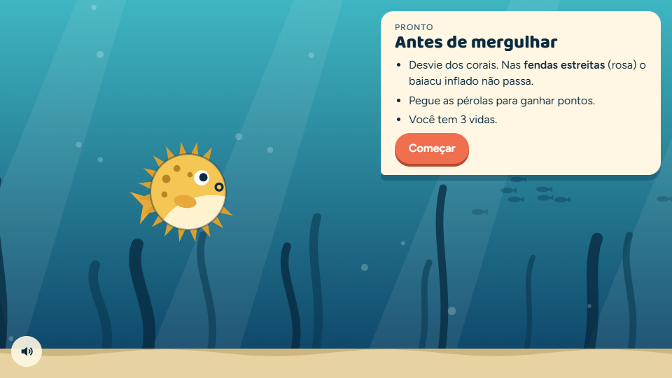 |
| Último passo: segure o baiacu **na faixa clara**. | Resumo das regras antes de mergulhar. |

São **4 passos com a câmera** e **3 com o teclado**. Cada um tem uma barra que só enche enquanto você faz o gesto certo.

| # | ✋ Câmera | ⌨️ Teclado | Para passar | ⏱️ |
|:---:|---|---|---|:---:|
| 1 | Mostre a mão para a câmera | (não tem) | Mão detectada | 1,0 s |
| 2 | Abra bem a mão | Segure a barra de espaço | Abertura acima de 70% | 1,2 s |
| 3 | Agora feche a mão | Solte a barra de espaço | Abertura abaixo de 30% | 1,2 s |
| 4 | Deixe a mão meio aberta | Dê toques curtos na barra | Baiacu dentro da faixa clara | 2,0 s |

- 📉 Nos passos 1 a 3, se você sai do gesto, a barra **esvazia aos poucos**. No passo 4 ela só para, sem perder o progresso.
- 👀 Se a mão some por mais de 0,6 s, aparece um aviso pedindo para trazê-la de volta.

### 🎯 Calibração automática

Cada mão é de um jeito: tem gente que abre muito, tem gente que não fecha tanto. Por isso, no tutorial com câmera, o jogo **aprende a sua mão**:

- 🖐️ No passo *Abra bem a mão*, ele guarda o máximo que você abriu e usa isso como **100%**.
- ✊ No passo *Agora feche a mão*, ele guarda o máximo que você fechou e usa isso como **0%**.
- 🛟 **Socorro automático:** se você passar **4 segundos** tentando sem conseguir, o jogo afrouxa o limite com base no que sua mão já mostrou.

> 💡 Pulou o tutorial? Vale a faixa padrão. Se o controle estiver estranho, use **Rever tutorial** na tela de fim de jogo para recalibrar.

---

## ⏸️ Pausa

| Motivo | Como volta |
|---|---|
| 🙈 A mão sumiu da câmera por mais de 0,45 s | **Sozinho!** Mostre a mão por 0,35 s e começa uma nova contagem de 3 s. |
| ⏸️ Botão *Pausar*, **`P`** ou **`Esc`** | *Continuar*, **`P`**, **`Esc`** ou **`Enter`**, com contagem de 3 s. |
| 🗂️ Você trocou de aba ou minimizou | Igual à pausa manual. |

Pontos e vidas ficam guardados durante a pausa, e o som fica mudo. 💾🔇

---

## 🤖 Como a mão é detectada

```
📷 Webcam ──► 🧠 MediaPipe (21 pontos da mão em 3D) ──► 📐 razão dedos/palma ──► 🎚️ abertura 0..1 ──► 🐡
```

1. 📷 O vídeo da webcam (640×480 de preferência, câmera frontal) vai quadro a quadro para o **MediaPipe Hand Landmarker**, rodando **no seu navegador**. Ele tenta usar a GPU e, se não der, usa a CPU. Só uma mão é rastreada.
2. 🦴 O detector devolve **21 pontos da mão** em coordenadas 3D reais.
3. 📐 O jogo calcula a **razão de abertura**: distância média das pontas do indicador, médio, anelar e mínimo até o pulso, dividida pelo tamanho da palma (pulso até a base do dedo médio).
   - ✊ Mão fechada: perto de **0,8 a 1,0**.
   - 🖐️ Mão aberta: perto de **1,8**.
   - 📏 Por ser uma razão, **não importa a distância da mão até a câmera**.
4. 🎚️ A razão vira a abertura de 0 a 1 usando a faixa **1,0 a 1,75** (ou a faixa calibrada no tutorial).
5. 🧈 Uma suavização tira as tremidas do rastreamento sem deixar o controle lento.

> 👍 O polegar não entra na conta, então tanto faz o que ele estiver fazendo.

---

## 🆘 Deu ruim?

| Mensagem ou sintoma | O que fazer |
|---|---|
| 🚫 *"A câmera foi bloqueada…"* | Clique no ícone de câmera ao lado do endereço, libere o acesso e tente de novo. |
| 🔍 *"Não encontrei nenhuma câmera…"* | Conecte uma webcam ou jogue com o teclado. |
| 📹 *"Outro programa está usando a câmera…"* | Feche Zoom, Teams, OBS ou outra aba usando a câmera. |
| 🧱 *"Aqui dentro a câmera não pode ser usada…"* | A página está num lugar sem acesso à câmera (prévia embutida, `http://` que não é `localhost`). Abra pelo Live Server no Chrome ou Edge. |
| 📶 *"Não consegui baixar o detector de mão…"* | Confira a internet. Redes corporativas às vezes bloqueiam o jsDelivr ou o Google Storage. |
| ⬆️ O baiacu não sobe o suficiente | Abra mais os dedos e afaste-os entre si, ou refaça o tutorial. |
| ⬇️ O baiacu não desce | Feche bem o punho, ou refaça o tutorial. |
| 🔁 Pausa toda hora | Melhore a luz, afaste a mão para caber inteira no quadro e evite fundos da cor da pele. |
| 🐢 Controle tremido ou atrasado | Feche abas pesadas. Sem GPU, o detector roda na CPU e fica mais lento. |
| 🔇 Sem som | Confira o botão de som (canto inferior esquerdo) e o volume do sistema. O som só começa depois do primeiro clique ou tecla. |
| 🪙 Moedas e roupas sumiram | O progresso fica no navegador: outro navegador, outro perfil ou uma janela anônima começam do zero. |

🔎 Detalhes técnicos dos erros aparecem no console do navegador, com o prefixo `[baiacu]`.

---

## 🧩 Estrutura do código

```
baiacu/
├── 📄 index.html   Telas: início, tutorial, pausa, fim de jogo, loja, botão de som e prévia da câmera
├── 🎨 style.css    Cartões, botões, loja e prévia da câmera
├── 🔊 audio.js     Som sintetizado (Web Audio API) → window.BaiacuSom
├── 🛍️ loja.js      Catálogo, desenho das roupas e tela da loja → window.BaiacuLoja
├── 🧠 game.js      Entrada, física, zonas, moedas, desenho e fluxo de telas
├── 🖼️ docs/        Imagens deste README
└── 📘 README.md
```

Os scripts são carregados por `<script>` comum, nessa ordem: `audio.js`, `loja.js`, `game.js`. Nada de módulos ES, para o jogo abrir direto do disco. Todo o visual é **desenhado em canvas 2D**, sem nenhuma imagem: baiacu, roupas, corais, algas e bolhas são feitos com código.

### 🗂️ Por dentro do `game.js`

| Seção | O que faz |
|---|---|
| ⚙️ `CFG` | Todos os números ajustáveis do jogo. |
| 🎨 `C` e `ZONES` | Cores fixas e a paleta de cada zona. |
| 💾 `loadSave`, `persist` | Progresso no `localStorage`, à prova de dados corrompidos. |
| 🖼️ `resize` | Ajusta o canvas à janela e à densidade de pixels da tela. |
| ✋ Entrada (`startCamera`, `detect`, `handRatio`, `updateInput`, `drawCam`) | Liga a câmera, carrega o detector e transforma mão ou teclado na abertura de 0 a 1. |
| 🐡 Jogo (`stepFish`, `stepWorld`, `spawnCol`) | Física, geração de corais e pérolas, colisões, pontos, vidas e moedas das pérolas. |
| 🌊 Zonas (`updateZone`, `DECOS`) | Troca de zona, interpolação de cores e enfeites. |
| 🎓 Tutorial (`STEPS`, `updateTutorial`) | Passos e calibração automática. |
| 🗺️ Telas (`setState`, `pause`, `gameOver`, `openShop`) | Troca de telas, botões, atalhos e som. |
| 🖌️ Desenho (`drawBackground`, `drawCols`, `drawFish`, `drawHud`, `render`) | Todo o visual. `drawFish` desenha em qualquer canvas, por isso a loja também usa ela. |
| 🔁 `frame` | Laço principal com `requestAnimationFrame` (passo de tempo limitado a 50 ms). |

Estados do jogo: `start` → `tutorial` → `countdown` → `playing` ⇄ `paused` → `over`, e `shop` a partir de `start` ou `over`.

### ♿ Acessibilidade

- 🫨 Com **reduzir movimento** ligado no sistema (`prefers-reduced-motion`), a tela não treme ao bater.
- 🔊 O tutorial usa `aria-live`, as mensagens usam `role="status"`, as abas da loja usam `role="tab"` e o botão de som usa `aria-pressed`.
- 🩷 A fenda estreita se distingue por **listras**, não só pela cor.
- ⌨️ Dá para jogar e comprar tudo só com o teclado.

---

## 🔧 Ajustando o jogo

Todo valor ajustável fica numa tabela no topo do arquivo dele.

### `CFG` (topo do `game.js`)

| Chave | Padrão | O que é |
|---|---|---|
| `H` | 540 | Altura lógica da tela (px) |
| `MIN_W` | 520 | Largura lógica mínima visível |
| `FLOOR` | 498 | Onde começa a areia |
| `R_MIN`, `R_MAX` | 13, 54 | Raio do baiacu murcho e inflado |
| `HIT` | 0.88 | Fração do raio que conta para bater |
| `V_MAX` | 250 | Velocidade vertical máxima (px/s) |
| `V_RESP` | 6 | Rapidez da resposta da velocidade (maior = menos inércia) |
| `DEAD` | 0.07 | Zona morta em torno da abertura 0,5 |
| `SPEED` | [165, 270] | Velocidade do cenário: início e máximo |
| `SPACING` | [430, 330] | Distância entre corais: início e máximo |
| `GAP` | [215, 170] | Passagem normal: início e máximo |
| `GAP_NARROW` | 100 | Altura da fenda estreita |
| `COL_W`, `COL_W_NARROW` | 74, 46 | Largura dos corais normal e estreito |
| `LEVEL_SCORE` | 60 | Pontos para chegar à dificuldade máxima |
| `LIVES` | 3 | Vidas por partida |
| `INV` | 1.6 | Segundos de invencibilidade depois de bater |
| `HAND_LOST` | 0.45 | Segundos sem mão até pausar |
| `HAND_BACK` | 0.35 | Segundos com a mão de volta até retomar |
| `RATIO_LO`, `RATIO_HI` | 1.0, 1.75 | Faixa padrão da razão dedos/palma (fechada → aberta) |
| `SMOOTH_CAM`, `SMOOTH_KEYS` | 16, 30 | Suavização na câmera e no teclado (maior = mais rápido) |
| `ZONE_SCORE` | 20 | Pontos por zona |
| `ZONE_FADE` | 2 | Segundos de transição de cores entre zonas |
| `ZONE_LABEL` | 2 | Segundos com o nome da zona na tela |
| `COINS_PER_PEARL` | 1 | Moedas por pérola |
| `COINS_PER_POINT` | 0.5 | Moedas por ponto no fim da partida (arredondado para baixo) |

### Outras tabelas

| Onde | O que ajustar |
|---|---|
| `ZONES` (topo do `game.js`) | Nome, enfeite e todas as cores de cada zona |
| `SOM` (topo do `audio.js`) | Volumes, altura e filtro do tom contínuo |
| `CORES`, `ROUPAS` (topo do `loja.js`) | Nomes, preços e cores dos itens da loja |

🍳 **Receitas rápidas:**

- 😌 **Modo relax:** aumente `GAP`, `SPACING` e `LIVES`, ou diminua `SPEED`.
- 🩷 **Fendas mais tranquilas:** aumente `GAP_NARROW`.
- 🎯 **Controle menos sensível:** aumente `DEAD` ou diminua `V_MAX`.
- 📹 **Câmera tremendo:** diminua `SMOOTH_CAM` (fica mais suave, com um pouco mais de atraso).
- 🪙 **Loja mais generosa:** aumente `COINS_PER_POINT` ou baixe os preços no `loja.js`.
- 🔉 **Tom contínuo incomodando:** baixe `SOM.TOM_VOL` ou `SOM.TOM_FILTRO` no `audio.js`.

---

## 🐛 Depuração

O jogo deixa o estado dele exposto no console do navegador:

```js
__baiacu.game    // estado, pontos, vidas, corais, pérolas e moedas das pérolas da partida
__baiacu.input   // modo, mão presente, razão bruta, faixa calibrada (lo/hi), abertura
__baiacu.fish    // posição, velocidade e raio do baiacu
__baiacu.save    // progresso salvo: recorde, moedas, itens, som
__baiacu.zone    // zona atual e progresso da transição
__baiacu.CFG     // ajustes, alteráveis em tempo real
```

🧪 Truques:

- `__baiacu.game.lives = 99` para jogar sem morrer.
- `__baiacu.save.coins = 1000` para testar a loja (o valor só fica salvo depois da próxima compra ou partida).
- `__baiacu.game.score = 60` para pular direto para o fundo escuro.
- `__baiacu.input.raw` para ver a razão da sua mão enquanto abre e fecha.

---

## 🔒 Privacidade

🛡️ O vídeo da câmera é processado **só no seu navegador**. Nenhuma imagem é gravada nem enviada para lugar nenhum. O progresso (recorde, moedas, itens, som) fica no `localStorage` do seu navegador e também não sai dele. A internet só serve para baixar o detector, o modelo e as fontes.

<div align="center">

---

**Bom mergulho!** 🐡🫧🪸

</div>
